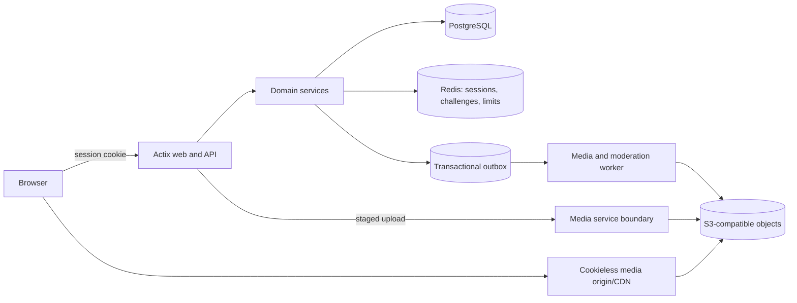

# RIB Repository Review

Date: 2026-07-11

## Implementation update

The original review below records the baseline found at the start of 2026-07-11. A subsequent implementation pass addressed the highest-risk items. The detailed findings remain as design history; this table is the current status.

| Finding                      | Current status                                                                                                                                                                                                                                                                                                                                                                                                                                                  |
| ---------------------------- | --------------------------------------------------------------------------------------------------------------------------------------------------------------------------------------------------------------------------------------------------------------------------------------------------------------------------------------------------------------------------------------------------------------------------------------------------------------- |
| F1 OAuth handoff             | Resolved: Discord OAuth now uses signed, expiring state plus PKCE and issues an HttpOnly same-site session cookie instead of putting the RIB token in a URL                                                                                                                                                                                                                                                                                                     |
| F2 arbitrary uploads         | Partially resolved: upload requires current admission, hashes are validated, UTF-8 detection is fixed, active/non-previewable files download as attachments, and immutable ETags are emitted. Quarantine, scanning, streaming, and a separate media origin remain                                                                                                                                                                                               |
| F3 abuse controls            | Partially resolved: proxy headers are opt-in with validated hop parsing, idle rate-limit keys are pruned, production limits are enabled, expired Bitcoin challenges are collected, and deployments are capped at one replica. Shared Redis state remains                                                                                                                                                                                                        |
| F4 Bitcoin bypasses          | Resolved for release builds: test bypass flags and balance overrides compile to no-ops outside debug builds                                                                                                                                                                                                                                                                                                                                                     |
| F5 revocation                | Substantially resolved: Discord is explicit-allowlist only, current membership and bans are checked on every write and renewal, logout clears server cookies, and moderators can ban private subjects. Privileged JWT claims remain valid until token expiry                                                                                                                                                                                                    |
| F6 attachment deduplication  | Resolved: multiple posts can reference one hash, ownership constraints are enforced, and duplicate-reference integration coverage replaces the placeholder repository test                                                                                                                                                                                                                                                                                      |
| F7 object lifecycle          | Partially resolved: hard deletion removes only the final blob reference and storage delete errors are no longer reported as success. Abandoned-upload expiry and a retryable deletion outbox remain                                                                                                                                                                                                                                                             |
| F8 descendant visibility     | Resolved: a soft-deleted board hides child thread and reply routes by direct ID, with regression coverage                                                                                                                                                                                                                                                                                                                                                       |
| F9 validation and bounds     | Partially resolved: board, post, attachment, subject, tripcode, and database constraints are enforced. Cursor pagination remains                                                                                                                                                                                                                                                                                                                                |
| F10 deployment drift         | Repository configuration resolved: every overlay renders matching Service/Ingress/MinIO names, HPA is capped at one, production defaults fail closed, toolchains are pinned, CI validates manifests, and production deploys are manual exact-SHA maintenance releases with backup acknowledgements and migration preflight. The live AKS cluster was inspected but not modified; backup, root credentials, and Kubernetes upgrade remain urgent operations work |
| F11 false-green tests        | Resolved: placeholder route/repository tests were replaced, integration setup fails if PostgreSQL is unavailable, CI applies migrations, 55 Rust tests execute against PostgreSQL, and the local wrapper migrates and drops a disposable database                                                                                                                                                                                                               |
| F12 dependency/tooling gates | Resolved for current code: Rust is pinned to 1.97.0, SQLx to 0.8.6, Vite to 6.4.3, and Vitest to 3.2.7. Rust format and strict Clippy pass, 39 frontend tests plus lint/build pass, full npm audit reports zero vulnerabilities, and RustSec reports zero reachable vulnerabilities with one documented disabled-MySQL exception                                                                                                                                |
| F13 frontend contracts       | Substantially resolved: cookie auth and anonymous session inspection share one AuthProvider, dead auth/API code is removed, unavailable actions are hidden, tripcodes and arbitrary downloads are supported, moderator identify/ban controls exist, and the media dialog is keyboard accessible. Desktop and 390px mobile browser smoke are clean; broader automated E2E coverage remains                                                                       |
| F14 media delivery           | Partially resolved: safe download policy, cache headers, ETags, audio/file rendering, and hash validation are implemented. Streaming, range requests, thumbnails, and CDN delivery remain                                                                                                                                                                                                                                                                       |
| F15 repository drift         | Substantially resolved: CI, toolchain, manifests, deployment secrets, embedded assets, public About copy, OpenAPI, README, contributor guide, and security policy now describe current behavior. Automated documentation/link checks remain useful follow-up                                                                                                                                                                                                    |

## Executive assessment

RIB is a credible early prototype of a public-read, authenticated-write, pseudoanonymous media board. It is intended to serve both as the engine for `rib.curlyquote.com` and as a reusable self-hosted product. Its strongest idea is not "an image board in Rust" by itself. The distinctive product is a discussion system where each board or instance can choose how somebody earns permission to post, including an allowlisted identity or an experimental cryptographic proof, without publishing that identity to ordinary readers while retaining private accountability for moderators.

The current repository is not ready for adversarial public traffic. The basic board, thread, reply, upload, role, and soft-delete flows exist, and both production builds complete. However, important security controls are missing or bypassable, the attachment model loses valid duplicate associations, the integration test suite can report false success, and most production claims in the README describe an intended system rather than this one.

The right next move is to harden the modular monolith and formalize the boundary between portable engine configuration and first-party instance configuration. Microservices, GraphQL, ML moderation, and federation would add cost before the core product, moderation model, and operational contract are trustworthy.

## Review scope

This review covered:

- Product intent and repository history
- Rust API, authentication, authorization, repository, storage, migrations, rate limiting, security headers, and OpenAPI generation
- React workflows, API contracts, responsive behavior, accessibility, and tests
- Docker, Compose, Kubernetes, Bicep, GitHub Actions, scripts, and documentation
- Read-only inspection of the live Azure subscription and `jk-aks-2` Kubernetes deployment
- Executable build, test, lint, format, dependency, Bicep, and Kustomize checks
- Current external guidance for OAuth, Bitcoin signed messages, file uploads, and relational constraints

Findings labeled "verified" follow directly from source or an executed check. Strategic observations are recommendations, not claims that a latent bug has already occurred.

## What the product actually is

The shipped product is narrower and more interesting than the README's broad platform description:

1. Anyone can read boards, threads, replies, and attachments.
2. Any Discord account can receive the default `User` role and post after OAuth login.
3. A person controlling a supported Bitcoin address with a queried balance of at least 0.01 BTC can also receive a `User` token.
4. Admins create boards and assign roles. Moderators and admins can soft-delete content. Admins can hard-delete it.
5. A post can reference one content-addressed attachment.
6. The React SPA is normally embedded in the Rust binary and served from the same origin.

That is a public-read, gated-write pseudonymous board, not the README's default-anonymous image board. The About page is closer to current intent than the top-level architecture document, although it also says Discord roles are manually granted when the backend grants `User` to any successful Discord login ([About.tsx](../rib-react/src/pages/About.tsx#L16-L40), [routes.rs](../src/routes.rs#L817-L859)).

## Product decisions recorded after review

The owner confirmed the following target behavior on 2026-07-11:

- RIB should support both the first-party `rib.curlyquote.com` instance and third-party self-hosting. Instance identity, operator details, domains, donation information, and policy must therefore be configuration, not product source.
- Bitcoin proof of value is an optional anti-spam experiment. Its purpose is to admit pseudoanonymous posters who are not Discord-allowlisted, not to prove a unique human, establish a public identity, or become a universal login requirement.
- Every post must retain a private stable moderation subject so authorized moderators can resolve the posting identity and ban it for abuse. Public APIs and ordinary readers must not receive that linkage.
- A poster may opt into public continuity with a classic password tripcode. The tripcode is public and linkable by choice; the tripcode password must never be stored or logged.
- Discord identities must be allowlisted before they can post. A successful OAuth exchange alone must not grant `User` posting permission.
- Arbitrary file support is intentional. The correction is to isolate, classify, scan, and download files safely, not to narrow the product to image/video formats.
- Files attached to public posts should remain publicly downloadable indefinitely. Abandoned staged uploads should expire, while hard deletion and legal takedown should remove the associated attachment according to policy.
- Live production currently uses in-cluster PostgreSQL and MinIO. It does not use managed PostgreSQL or managed object storage.

These decisions resolve the largest product ambiguity. They also make admission, optional public persona, and private moderation identity separate concepts, which should be reflected in the domain model.

### Claims that do not match the implementation

| Documented claim                                                                                                     | Current implementation                                                                                                                                             |
| -------------------------------------------------------------------------------------------------------------------- | ------------------------------------------------------------------------------------------------------------------------------------------------------------------ |
| PostgreSQL and SQLite are pluggable                                                                                  | PostgreSQL is the only repository backend ([repo.rs](../src/repo.rs#L62-L67))                                                                                      |
| Storage is pluggable and supports local development                                                                  | The trait is pluggable, but the only factory implementation is S3/MinIO and startup panics without it ([storage.rs](../src/storage.rs#L183-L190))                  |
| Redis caches boards, threads, rate limits, and sessions                                                              | Redis is deployed but no Redis crate or runtime path uses it                                                                                                       |
| Anonymous posting and tripcodes                                                                                      | Thread and reply creation require a valid JWT; tripcodes do not exist ([routes.rs](../src/routes.rs#L218-L272), [routes.rs](../src/routes.rs#L471-L524))           |
| `Idempotency-Key` support                                                                                            | There is no idempotency middleware or request handling; only object hashes make upload storage partly idempotent                                                   |
| Search, partitioning, thumbnails, quarantine, scanning, CAPTCHA, spam filtering, GDPR APIs, audit logs, CDN delivery | None are implemented                                                                                                                                               |
| Broad Prometheus, tracing, and business metrics                                                                      | The server exposes a metrics endpoint, but only rate-limit counters are emitted ([main.rs](../src/main.rs#L185-L205), [routes.rs](../src/routes.rs#L226-L234))     |
| Static OpenAPI at `/docs/api/openapi.yaml`                                                                           | That file does not exist. A partial generated JSON document is served by Swagger UI ([openapi.rs](../src/openapi.rs#L1-L32))                                       |
| SvelteKit sibling frontend with HttpOnly cookies                                                                     | The repo contains an embedded React SPA using a bearer token in localStorage ([README.md](../README.md#L511-L568), [auth.ts](../rib-react/src/lib/auth.ts#L6-L58)) |
| CI runs Rust format, Clippy, tests, audit, staging, smoke, then production                                           | The only workflow runs React tests/build, builds a Docker image, and deploys directly to AKS ([deploy-prod.yml](../.github/workflows/deploy-prod.yml#L31-L168))    |

The README should describe verified current behavior first. Future design belongs in a roadmap or ADRs with explicit status.

## What is working well

- The core domain is small enough to remain a modular monolith. Actix, SQLx, PostgreSQL, and S3-compatible storage are reasonable choices.
- SQL is parameterized. There was no obvious SQL injection path in the reviewed repository.
- JWT expiry is validated by the request extractor, and role guards are present on privileged handlers ([auth.rs](../src/auth.rs#L24-L59)).
- Security middleware sets a meaningful CSP, `nosniff`, frame denial, and a no-referrer policy ([security.rs](../src/security.rs#L47-L90)).
- React renders post text as React nodes instead of raw HTML. External embeds are opt-in and limited to YouTube and SoundCloud ([linkify.ts](../rib-react/src/lib/linkify.ts#L60-L129)).
- Soft-delete and restore semantics are represented in both schema and API, which is a useful moderation foundation.
- Uploads have an early per-file size check, hash content with SHA-256, and inspect bytes instead of trusting the multipart `Content-Type` header ([routes.rs](../src/routes.rs#L604-L664)).
- The CI deployment uses an immutable commit-SHA image tag. The application container runs as a non-root user.
- GitHub OIDC and Key Vault are used for application secrets in the automated AKS deployment ([deploy-prod.yml](../.github/workflows/deploy-prod.yml#L59-L132)).
- There are focused tests for JWT extraction, Bitcoin signatures, upload boundaries, moderation, rate limiting, and security headers. Their execution contract needs repair, but the test intent is useful.

## Priority findings

| ID  | Priority | Finding                                                                                                                                           | Release impact                                                                              |
| --- | -------- | ------------------------------------------------------------------------------------------------------------------------------------------------- | ------------------------------------------------------------------------------------------- |
| F1  | Blocker  | Discord OAuth has no transaction-bound `state`, nonce, or PKCE, then places the RIB bearer JWT in a URL query parameter                           | Login CSRF/code injection and token leakage risk                                            |
| F2  | Blocker  | Intentional arbitrary-file upload is unauthenticated and serves active or unknown content from the application origin                             | Storage abuse and unnecessary active-content risk                                           |
| F3  | Blocker  | Per-IP limits trust the first caller-supplied forwarding header, are disabled in app config, retain arbitrary keys forever, and do not cover auth | Limits can be bypassed and turned into a memory-growth vector                               |
| F4  | Blocker  | Bitcoin test bypasses are compiled into production and controlled by environment variables                                                        | A configuration mistake disables signature or balance verification                          |
| F5  | Blocker  | Role revocation is not authoritative, token renewal preserves stale claims indefinitely, and Bitcoin role assignments are ignored                 | A removed admin can retain access; configured Bitcoin roles do not work                     |
| F6  | High     | The blob hash is globally unique in the attachment table, and association inserts silently do nothing on duplicate hash                           | The same file cannot be attached to a second post even though upload says duplicate success |
| F7  | High     | Hard deletion and unattached uploads have no reliable object lifecycle; board/thread deletes orphan S3 objects                                    | Permanent storage leaks and unverifiable deletion semantics                                 |
| F8  | High     | Soft-deleting a board does not hide a child thread reached by direct ID                                                                           | Moderated content remains publicly reachable                                                |
| F9  | High     | Core text, slug, hash, MIME, and attachment-owner invariants are not enforced; lists have no pagination                                           | Invalid data, unbounded responses, and avoidable scale failure                              |
| F10 | Blocker  | Dev/prod manifests are inconsistent, while live AKS uses root datastore credentials on one obsolete node with no verified data backup             | Deployment failure, full-instance outage, credential exposure, or permanent data loss       |
| F11 | High     | Database integration tests silently return success without a database; real execution currently has four failures                                 | CI and local green results can be false                                                     |
| F12 | High     | Frontend production dependencies include a high-severity React Router advisory                                                                    | Known runtime vulnerability ships in the SPA                                                |
| F13 | Medium   | The SPA exposes unavailable actions, duplicates auth state, has stale API types, and has weak mobile/accessibility behavior                       | Confusing workflows and fragile maintenance                                                 |
| F14 | Medium   | Media is buffered through Actix without range, cache, or ETag support                                                                             | Poor video seeking, high memory usage, and an unnecessary backend bottleneck                |
| F15 | Medium   | Documentation, generated assets, generated ARM JSON, scripts, and current source have drifted apart                                               | Operators cannot tell which instructions or artifacts are authoritative                     |

## Detailed findings

### F1. OAuth flow and bearer delivery are unsafe

Status: Verified.

`discord_login` constructs an authorization request with `client_id`, `redirect_uri`, response type, and scope only. The callback accepts only a `code`; no transaction is bound to the browser that initiated it ([routes.rs](../src/routes.rs#L714-L777)). RFC 9700 requires clients to prevent CSRF with transaction-specific PKCE, OpenID Connect nonce, or a one-time `state` value securely bound to the user agent.

After exchange, the backend redirects to `/?token=<RIB JWT>` ([routes.rs](../src/routes.rs#L860-L866)). The SPA removes it in an effect, but the bearer token has already passed through browser history and may pass through ingress, proxy, or access logs ([App.tsx](../rib-react/src/App.tsx#L17-L31)). `Referrer-Policy: no-referrer` helps with later navigation but does not remove those exposures.

Recommendation:

- Use a maintained OAuth/OIDC client library.
- Add PKCE with S256 and transaction-bound state. Make both one-time and short-lived.
- Prefer a `Secure`, `HttpOnly`, `SameSite=Lax` session cookie because the production SPA and API share an origin.
- If bearer tokens must remain, redirect with a one-time exchange code and redeem it through a back-channel API. Do not put the access token in a URI.
- Check Discord response status before deserialization and set explicit connect/request timeouts.

### F2. Intentional arbitrary-file support lacks the required isolation

Status: Verified.

`POST /api/v1/images` has no `Auth` extractor ([routes.rs](../src/routes.rs#L604-L608)). The intentionally broad allowlist includes HTML, SVG, archives, office documents, and `application/octet-stream`, which is effectively an allow-unknown rule ([routes.rs](../src/routes.rs#L538-L601)). The resulting object is publicly served inline from the application origin without `Content-Disposition` ([routes.rs](../src/routes.rs#L672-L691)). The frontend only allows users to select images and videos, so it does not expose the backend's intended arbitrary-file capability or provide safe download affordances ([BoardThreadsPage.tsx](../rib-react/src/pages/BoardThreadsPage.tsx#L171-L177), [ThreadPage.tsx](../rib-react/src/pages/ThreadPage.tsx#L282-L288)).

The code also accepts any path string of length at least two, then slices `hash[0..2]` as UTF-8 in storage. A decoded value such as `a` followed by a multibyte character can make that slice land inside a code point and panic ([routes.rs](../src/routes.rs#L672-L679), [storage.rs](../src/storage.rs#L97-L99)).

Recommendation:

- Require posting authorization before upload and bind each staged upload to the authenticated subject.
- Validate exactly 64 lowercase hexadecimal hash characters on reads and associations.
- Preserve broad file support, but classify each format into previewable and download-only delivery policies. Unknown binary, HTML, SVG, archives, and office formats should never execute in the application origin.
- Serve user content from a separate cookieless media origin. Force `Content-Disposition: attachment` for active, unknown, and non-previewable types; add `X-Content-Type-Options: nosniff` there as well.
- Add quarantine state, malware scanning, archive-bomb defenses, image decode/re-encode where appropriate, and cleanup of abandoned stages. Never automatically extract an archive into a public path.
- Extend the frontend to select arbitrary files and display name, detected type, size, scan state, and an explicit download action. Inline preview should remain limited to formats with a deliberately supported renderer.
- Align ingress and API limits. Ingress currently rejects above 15 MiB while the API advertises 25 MiB ([ingress.yaml](../k8s/base/ingress.yaml#L6-L10)).

### F3. Abuse controls are bypassable and inconsistent with horizontal scaling

Status: Verified.

The application trusts the first value in `X-Forwarded-For` before the socket peer ([routes.rs](../src/routes.rs#L16-L38)). A direct caller or proxy configuration that preserves an inbound header can choose a new key for every request. RFC 9700's reverse-proxy guidance specifically warns that inbound security-relevant forwarding headers must be sanitized.

The `DashMap` prunes timestamps within a key but never removes the key itself. Combined with spoofed addresses, cardinality grows without bound ([rate_limit.rs](../src/rate_limit.rs#L6-L31)). The limiter is disabled unless `RL_ENABLED` is explicitly true, and no Kubernetes ConfigMap enables it ([main.rs](../src/main.rs#L158-L159), [configmap.yaml](../k8s/base/configmap.yaml#L1-L21)). Bitcoin challenge/verify and Discord login/callback have no application limit.

Ingress has a broad request cap, but WAF creation defaults off and the app's business limits remain pod-local. Bitcoin challenge state is also pod-local, so a challenge issued by pod A fails when verification reaches pod B.

Recommendation:

- Define trusted proxy hops and derive the client address only from headers rewritten by that proxy.
- Rate-limit login, challenge, verify, upload bytes, and failed verification, not only successful content actions.
- Move ephemeral challenge and abuse state into Redis if multi-replica operation is a real requirement. Otherwise run one app replica and document the limit.
- Bound key cardinality and expire idle keys.
- Enable safe defaults in production, with an explicit emergency bypass rather than opt-in protection.

### F4. Production contains runtime authentication bypass switches

Status: Verified.

`BTC_AUTH_TEST_SKIP_SIG`, `BTC_AUTH_TEST_SKIP_BALANCE`, and `BTC_AUTH_TEST_BALANCE_OVERRIDE` are read by production code without `cfg(test)` or a compile-time feature ([routes.rs](../src/routes.rs#L1056-L1078), [routes.rs](../src/routes.rs#L1161-L1166)). The source comment says they are never set in production, but nothing enforces that.

Recommendation:

- Remove runtime bypasses from the production binary.
- Inject a balance client and signature verifier through traits in tests.
- If an end-to-end test mode is unavoidable, compile it behind a feature that the release build and CI deployment explicitly reject.

### F5. Authorization cannot be revoked reliably

Status: Verified.

JWTs carry role claims for 24 hours. The renewal endpoint accepts a still-valid access token and issues another 24-hour token with the same claims without consulting `user_roles` ([auth.rs](../src/auth.rs#L62-L87), [routes.rs](../src/routes.rs#L869-L874)). Repeating this before expiry allows a removed role to survive indefinitely. This is not an expired-token bug: `Auth` correctly rejects expired JWTs. The issue is indefinite renewal of stale authority.

Discord role lookup occurs only during callback. An unknown Discord subject falls through to `Role::User`, which directly conflicts with the confirmed allowlist policy ([routes.rs](../src/routes.rs#L841-L857)). Bitcoin verification always issues `User`, so an admin entry such as `btc:<address>` in the role table and Admin UI is never applied ([routes.rs](../src/routes.rs#L1079-L1082)). There is no server-side logout or token revocation.

Recommendation:

- Pick one role model. The database stores one hierarchical role while JWT claims store a vector.
- Use `user_roles` as the Discord allowlist: an explicit `discord:<id>` row grants its configured role, an absent row denies posting admission, and the narrowly configured bootstrap-admin path remains the recovery exception.
- Redirect a successfully authenticated but non-allowlisted Discord user to a clear pending/denied screen without issuing a posting session. Update the Admin UI and About copy to describe this behavior.
- Use short-lived access tokens plus an opaque, rotating, revocable session, or use an opaque server session cookie.
- Resolve current role when a session is created or renewed. Invalidate sessions when a role changes.
- Apply the same provider-subject lookup to every authentication provider.
- Add `iss`, `aud`, `iat`, and `jti` if JWT access tokens remain, plus a key-rotation plan.
- Record role changes in a moderation audit log and prevent accidental removal of the last recoverable admin.

### F6. Blob deduplication is modeled as attachment uniqueness

Status: Verified.

The `images` table makes `hash` globally unique ([20250831000001_init.sql](../migrations/20250831000001_init.sql#L27-L35)). Creating a thread or reply inserts an ownership row with `ON CONFLICT (hash) DO NOTHING`, and the result is ignored ([repo.rs](../src/repo.rs#L192-L219), [repo.rs](../src/repo.rs#L320-L345)).

Reproduction by inspection:

1. Post A uploads and attaches hash H.
2. Post B uploads the same bytes. Upload correctly returns H with `duplicate: true`.
3. Post B tries to insert H. The global unique conflict is ignored.
4. Post B is created without an attachment.

The table also does not enforce exactly one of `thread_id` or `reply_id`, so an attachment can theoretically have both or neither.

Recommendation:

- Separate immutable blobs from post associations:
  - `blobs(hash primary key, object_key, detected_mime, size, scan_status, created_at)`
  - `attachments(id, blob_hash foreign key, thread_id, reply_id, original_name, created_by, created_at)`
- Add a check that exactly one owner ID is non-null.
- Permit many attachment rows to reference one blob.
- Treat client-supplied MIME as advisory. Read canonical MIME and size from the blob row.

### F7. Object lifecycle is not transactional or recoverable

Status: Verified.

Uploading writes S3 before a post exists, but there is no staged-upload record or garbage collector if post creation fails. Hard-deleting a board or thread deletes database rows only, leaving every associated object in S3 ([routes.rs](../src/routes.rs#L388-L422)). Reply hard-delete attempts object cleanup, but storage deletion discards every S3 error and always returns success ([routes.rs](../src/routes.rs#L445-L464), [storage.rs](../src/storage.rs#L166-L179)).

The runtime also attempts to create the bucket at startup. That requires broader permissions than the least-privilege production guidance claims ([storage.rs](../src/storage.rs#L45-L91)).

Recommendation:

- Provision buckets out of band. Runtime credentials should only access the required prefix and operations.
- Use staged uploads with an expiry and an explicit claim/attach transaction.
- Write deletion intents to a transactional outbox. A worker should delete unreferenced blobs, retry failures, and expose a dead-letter metric.
- Add a periodic reconciler that compares database references to object inventory.
- Implement the confirmed retention policy: attachments on public posts remain public indefinitely; soft-deleted media is hidden but retained for restoration/moderation; abandoned stages expire; hard-deleted or legally removed media is purged through the retryable deletion workflow.

### F8. Board soft deletion does not hide descendants by direct URL

Status: Verified.

Listing a board's threads checks the board's `deleted_at`. `GET /threads/{id}` checks only the thread's own marker and never checks its parent board ([routes.rs](../src/routes.rs#L166-L201), [routes.rs](../src/routes.rs#L275-L305)). A thread under a soft-deleted board therefore disappears from navigation but remains publicly reachable by ID. The same thread can still expose its reply list.

Recommendation:

- Make visibility a repository/domain invariant, not repeated handler logic.
- Query active descendants by joining active ancestors, with a privileged include-deleted path for moderators.
- Add direct-ID tests for deleted board, thread, and reply ancestry.
- Add deletion reason, actor, timestamp, audit event, and optional scheduled purge.

### F9. Core invariants and result sizes are unbounded

Status: Verified.

The README claims a slug regex and 2,000-character post limit, but neither handlers nor migrations enforce them. Empty replies, very large text, arbitrary subjects, malformed hashes, caller-selected MIME, and invalid attachment ownership can enter through the API. Board, thread, reply, and role lists have no pagination.

There are also no indexes on `images.thread_id` or `images.reply_id`, although list queries perform a lateral lookup for each post ([repo.rs](../src/repo.rs#L165-L190), [repo.rs](../src/repo.rs#L296-L318)). This becomes expensive as the table grows.

Recommendation:

- Define validated request DTOs rather than using persistence models as request bodies.
- Enforce important invariants twice: friendly API validation and database `CHECK`, foreign-key, and uniqueness constraints.
- Use cursor pagination for threads and replies, with stable `(bump_time, id)` and `(created_at, id)` cursors.
- Add partial indexes appropriate to active content and owner lookups.
- Define board-level policy for maximum replies, bump limit, thread expiry, attachment count, and allowed media.

### F10. Deployment configurations do not describe one runnable production system

Status: Verified.

Rendered Kustomize output shows:

- Dev creates `rib-backend-dev`, but its Ingress routes to `rib-backend-aks`.
- Prod creates `rib-backend-prod`, but its Ingress routes to `rib-backend-aks`.
- Base configuration hardcodes `S3_ENDPOINT=http://minio-aks:9000`, which also mismatches dev/prod suffixed MinIO Services ([configmap.yaml](../k8s/base/configmap.yaml#L10-L16), [ingress.yaml](../k8s/base/ingress.yaml#L27-L35)).

Only the AKS overlay happens to match those names. The same base deploys a single Postgres with password `postgres` and a single MinIO with `minioadmin` root credentials ([postgres-statefulset.yaml](../k8s/base/postgres-statefulset.yaml#L34-L45), [minio-statefulset.yaml](../k8s/base/minio-statefulset.yaml#L35-L46)). If AKS uses these services, the credentials are known. If Key Vault points the app at managed services, these stateful workloads are unnecessary attack surface and cost.

Additional gaps:

- No NetworkPolicy, backup job, disruption budget, or restricted container security context
- Redis is deployed with ephemeral storage but unused by the application
- Readiness proves only that the process responds, not that PostgreSQL or S3 remains usable ([routes.rs](../src/routes.rs#L974-L978))
- The database pool is hardcoded to five connections instead of configuration tied to replica count and database capacity ([main.rs](../src/main.rs#L121-L131))
- App startup owns migrations. SQLx tracks them, but release rollback and schema rollout remain coupled to every replica startup.
- WAF is defined and bound correctly in current Bicep source, but defaults off. The checked-in `main.json` was generated from an older template and lacks the current security policy ([main.bicep](../infra/bicep/main.bicep#L67-L133), [main.json](../infra/bicep/main.json#L1-L25)).

Live inspection on 2026-07-11 resolved the managed-service question:

- The backend connects to `postgres-aks:5432/rib`; no Azure Database for PostgreSQL resource exists in the active subscription.
- The backend uses `http://minio-aks:9000`. PostgreSQL and MinIO are single-replica StatefulSets with 5 GiB and 10 GiB Azure Disk PVCs.
- The application database user is the PostgreSQL superuser, and its password matches the literal StatefulSet password. The S3 access key and secret match MinIO's root credentials.
- Redis runs as `redis-aks`, but the live Secret points to host `redis`. Current application code does not use Redis, which hides the configuration error.
- Backend, PostgreSQL, MinIO, and Redis all run on one node. The node and control plane are Kubernetes 1.25.15, while Azure currently offers a 1.33 upgrade path.
- The backend HPA can scale from one to ten replicas. Scaling above one would make pod-local Bitcoin challenges intermittently fail and multiply local rate-limit allowances.
- There are no RIB CronJobs, NetworkPolicies, VolumeSnapshots, matching Azure disk snapshots, managed backup vaults, or PostgreSQL WAL archives. The PVC storage class has reclaim policy `Delete`.
- Two Ingress objects remain: the active `rib.curlyquote.com` route and a stale `rib.local` route. Both target the AKS backend and use the same TLS Secret.
- The running backend image tag is not present in the current local Git history, so the deployed artifact is not traceable from this checkout.

This is a single-node stateful deployment with persistent disks, not a backed-up or highly available production system. Persistent disk protects against a container restart; it does not provide a recovery point for deletion, corruption, credential compromise, cluster loss, or a failed upgrade.

Recommendation:

- Before any cluster or application upgrade, take verified PostgreSQL and MinIO backups outside the cluster and perform a restore test.
- Rotate PostgreSQL and MinIO credentials. Give the application a non-superuser database role and a bucket-scoped MinIO service account.
- Upgrade AKS through a supported, tested sequence after backups exist. Add at least one additional node or explicitly document accepted full-instance downtime.
- Offer two explicit supported profiles:
  - Single-node Compose for evaluation and small private instances
  - Production with managed PostgreSQL and object storage, plus optional managed Redis
- Make overlays own every environment-specific hostname and endpoint. Add `kustomize build` validation in CI.
- Remove in-cluster stateful services from the managed production overlay or secure and back them up as first-class production data stores.
- Run migrations as a controlled pre-deploy job with backward-compatible rollout rules.
- Split liveness from dependency-aware readiness.
- Generate ARM JSON in CI or stop checking it in. Never maintain Bicep and compiled JSON independently.

### F11. The test suite can be green without running integration tests

Status: Verified by execution.

Most Rust integration tests return normally when `DATABASE_URL` is absent or connection fails. Cargo counts those functions as passed. Two suites are explicit `assert!(true)` placeholders ([repo_tests.rs](../tests/repo_tests.rs#L1-L6), [routes_api.rs](../tests/routes_api.rs#L1-L5)). The deploy workflow does not run Rust tests at all.

With no database configured, `cargo test` reported all 33 Rust tests passed. After starting local Postgres and applying migrations, `cargo test --no-fail-fast` produced four failures across three targets:

- `created_by`: response deserialization expects a field the API intentionally skips
- `deletion_moderation`: two tests fail for the same hidden-field contract
- `images`: plain text is detected as `application/octet-stream`, not the asserted `text/plain`

This is a useful signal: the hidden-author decision, frontend types, and tests disagree about the public API.

Recommendation:

- Fail test setup when a required dependency is absent. Do not return success to mean skipped.
- Start PostgreSQL as a CI service, run migrations, and execute all Rust tests.
- Use isolated databases or transaction rollback so tests do not pollute shared developer data.
- Replace placeholders with repository and route contract tests.
- Add integration coverage for OAuth state/PKCE, renewal/revocation, role providers, duplicate attachment association, direct descendant visibility, object cleanup, trusted proxy handling, pagination, and concurrency.
- Add browser E2E tests for login, posting, upload failure, moderation, mobile navigation, and session expiry.

### F12. Dependency and quality gates are not green

Status: Verified by execution.

- `npm audit --omit=dev` reports three high-severity production advisories in the React Router chain, including GHSA-2w69-qvjg-hvjx.
- Full `npm audit` reports 19 advisories: 1 critical, 11 high, 6 moderate, and 1 low.
- `cargo-audit` is not installed locally, and no workflow runs it.
- `cargo fmt --all -- --check` fails across source and tests.
- strict Clippy fails with five errors.
- `npm run lint` cannot start because `.eslintrc.cjs` extends `prettier` without the `eslint-config-prettier` package ([.eslintrc.cjs](../rib-react/.eslintrc.cjs#L1-L20), [package.json](../rib-react/package.json#L20-L40)).
- Rust warns that SQLx 0.7.4 contains future-incompatible code.

Recommendation:

- Add a non-deploying required CI workflow for Rust and React format, lint, tests, audit, build, migration, OpenAPI diff, Kustomize render, and Bicep build.
- Update React Router immediately, then update the development toolchain in controlled batches.
- Upgrade SQLx and inspect the future-incompatibility report.
- Pin the Rust toolchain. The Dockerfile uses a floating nightly image for both build and runtime, while the README says Rust 1.75 ([Dockerfile](../Dockerfile#L1-L7), [README.md](../README.md#L599-L605)).
- Use `npm ci` in Docker and a small pinned runtime image. The current runtime contains the full nightly Rust toolchain ([Dockerfile](../Dockerfile#L29-L56)).
- Pin or verify the Kustomize installer instead of piping a mutable branch script into a shell.

### F13. Frontend behavior does not enforce the product's own rules

Status: Verified.

- Logged-out visitors see thread and reply forms; failure happens only after submit.
- Every visitor sees "Edit board" even though the backend permits only admins ([BoardThreadsPage.tsx](../rib-react/src/pages/BoardThreadsPage.tsx#L118-L128)).
- `useAuth()` is not a shared provider. Navbar and each page independently fetch `/auth/me` and register global listeners ([useAuth.ts](../rib-react/src/hooks/useAuth.ts#L13-L52)).
- Old placeholder auth stores a fake moderator and `dev-token` in a second localStorage scheme, although no current caller uses it ([auth.ts](../rib-react/src/lib/auth.ts#L5-L42)).
- Frontend types require `reply_count` and `created_by`, but the backend returns neither. Requests also send an ignored `created_by` field ([useThreads.ts](../rib-react/src/hooks/useThreads.ts#L4-L16), [useReplies.ts](../rib-react/src/hooks/useReplies.ts#L4-L13)).
- A dead `setDiscordRole` client calls the nonexistent `/admin/discord-roles` endpoint ([api.ts](../rib-react/src/lib/api.ts#L138-L159)).
- API errors are often raw response bodies, and several moderation click handlers do not catch failures.
- There are no responsive breakpoint classes or ARIA attributes in `src`. The login card is fixed at 384 px and nests a second full-screen minimum height inside the app shell ([LoginPage.tsx](../rib-react/src/pages/LoginPage.tsx#L51-L54)).
- The media modal has no dialog semantics, focus trap, close control, alt text, or keyboard-operable previous/next controls ([MediaModal.tsx](../rib-react/src/components/MediaModal.tsx#L17-L73)).
- Thread attachments treat every non-image as video, while reply attachments silently omit non-image/non-video media.

Recommendation:

- Add one `AuthProvider` or cached auth query and route-level capability guards.
- Remove dead auth/client code and generate TypeScript types from the authoritative OpenAPI contract.
- Hide or disable actions the current subject cannot perform and provide an explicit login call to action.
- Normalize API problem responses into useful field and action errors.
- Design mobile navigation and forms intentionally. Add semantic labels, focus management, modal dialog behavior, and visible focus states.
- Replace copied `created_by` JSON with a private `moderation_subject_id` foreign key to a normalized provider-subject record. Public DTOs must omit it; moderator-only APIs must resolve it and support bans. Add an optional classic password tripcode only when the poster chooses public continuity.

### F14. Media delivery negates most S3/CDN advantages

Status: Verified.

Each upload accumulates the full file in a `Vec<u8>`. Each download retrieves the full S3 object into memory and proxies it through Actix ([routes.rs](../src/routes.rs#L620-L659), [storage.rs](../src/storage.rs#L150-L164)). There is no byte-range handling, ETag, conditional request, or cache policy on attachment responses. Video seeking and repeated media delivery therefore hit the app and object store inefficiently.

Recommendation:

- Stream upload bytes to quarantine while hashing, with a total request/body limit before multipart parsing.
- Serve approved objects through a media host/CDN or an internal redirect mechanism.
- Support `Range`, `HEAD`, ETag, immutable cache headers, and content length.
- Generate bounded thumbnails and metadata asynchronously. Catalog pages should use thumbnails, not originals.

### F15. Repository drift is now a product risk

Status: Verified.

Examples:

- README roadmap leaves PostgreSQL, S3, and rate limiting unchecked although code exists, while claiming many absent production controls.
- README describes a SvelteKit sibling repo and components that do not exist.
- README links missing `docs/dev-workflow.md`; CONTRIBUTING links missing `SECURITY.md`.
- The generated OpenAPI omits many live routes, security schemes, and error contracts.
- A fresh Vite build references different assets than checked-in `embedded-frontend`, so ordinary local `cargo build` can embed stale UI.
- `infra/bicep/main.json` does not represent current `main.bicep`.
- `Makefile` defines `docker-dev` twice, with the later deprecated recipe overriding the useful alias ([Makefile](../Makefile#L11-L18), [Makefile](../Makefile#L60-L62)).
- The manual AKS script appends a second top-level `images:` key and creates unsuffixed `postgres`/`redis` URLs for `-aks` Services ([deploy-aks.sh](../scripts/deploy-aks.sh#L111-L161)).
- The smoke test defaults the frontend to port 3000 even though the supported production frontend is embedded at 8080 ([smoke.sh](../scripts/smoke.sh#L6-L11)).

Recommendation:

- Replace the README with a short, tested current-state guide.
- Add `docs/product.md`, `docs/architecture.md`, `ROADMAP.md`, `SECURITY.md`, and small ADRs. Mark every future item as proposed.
- Generate frontend assets, OpenAPI clients/specs, and ARM JSON in CI. Prefer build artifacts over checked-in generated output.
- Add documentation link checking and runnable quick-start smoke tests.

## Product and feature gaps

### Required for a credible image board

| Capability                   | Why it matters                                                                                                                                         |
| ---------------------------- | ------------------------------------------------------------------------------------------------------------------------------------------------------ |
| Reports and moderation queue | The `reports` table/model exists, but users cannot report content and moderators have no queue                                                         |
| Ban and abuse controls       | Moderators need subject/IP-risk controls, expiry, reason, appeal context, and audit history                                                            |
| Thread state                 | Lock, sticky, permasage, bump limit, reply limit, archive, and board policy are core board mechanics                                                   |
| Quote links and backlinks    | `>>post` references are a central discussion navigation pattern; current linkification handles only HTTP URLs                                          |
| Catalog view                 | Thread thumbnail, reply/media counts, last activity, sorting, and pagination are more useful than the current flat row list                            |
| Search and archive           | Search within a board plus archived read-only threads should precede federation                                                                        |
| Attachment metadata          | Original name, size, dimensions/duration, alt text, scan state, and safe download behavior                                                             |
| Operator configuration       | Instance name, operator/contact, donation address, domains, auth modes, thresholds, policies, and branding should not be hardcoded in React/Kubernetes |
| Policy surfaces              | Terms, privacy disclosure, content policy, takedown/report process, and retention policy are necessary for public user-generated content               |
| Export and recovery          | Tested database/object backup, restore drill, board export, and versioned release process                                                              |

### High-value product improvements

- Draft persistence and upload progress
- Reply preview before posting
- New-reply polling with a visible count, followed later by SSE if needed
- RSS/Atom per board for a simple self-hosted distribution channel
- Board-local search filters and media-only catalog
- Moderator dashboard with reasoned actions, bulk selection, and audit trail
- User-controlled content filters, muted boards/subjects, and reduced-motion/media settings
- Accessible keyboard navigation and a mobile-first thread layout
- Import/export tools for migration from another board engine

### Confirmed direction: policy-gated pseudoanonymous communities

The Bitcoin work becomes a product advantage when it is separated from identity and expressed as an optional admission policy. Discord allowlisting is the controlled path; Bitcoin proof of value is the experimental path for somebody who wants to post pseudoanonymously without being pre-approved.

Instead of hardcoding Discord and a 0.01 BTC check into authentication, model:

- Identity/admission proof: allowlisted Discord subject, Bitcoin signer, invite capability, or future provider
- Admission policy: who may read, post, upload, or moderate on an instance or board
- Capability/session: the revocable permission RIB issues after policy succeeds
- Public persona: anonymous by default, with an optional classic password tripcode
- Moderation identity: a durable private subject link that only moderators/admins can resolve and ban

Admission should mint a short-lived posting capability. Post creation validates that capability and stores a private `moderation_subject_id`, not a copied provider metadata snapshot or capability token. The public post representation omits this field. Moderator-only detail and ban workflows resolve the subject to its Discord identity, Bitcoin address, or other provider key. This is pseudoanonymous to the public, accountable to moderators, and explicit enough to disclose in the privacy policy.

For opt-in identity, use the familiar classic tripcode interaction: a poster enters an optional name and tripcode password, and RIB renders a stable marker such as `name !tripcode`. Use a modern instance-scoped derivation, such as a versioned HMAC-SHA-256 keyed by a dedicated tripcode secret, rather than legacy DES-style tripcode algorithms. Store only the derived marker with the post. The password must be excluded from traces, request logs, errors, analytics, and persistence. The UI should explain that reusing a tripcode makes posts publicly linkable and that a weak password may still be guessed through online attempts or server compromise.

For Bitcoin specifically:

- Adopt BIP 322 rather than a custom compact-signature dialect if wallet interoperability is required.
- Treat balance as an optional admission signal, not proof of a unique human or durable ownership. BIP 322 explicitly notes that a signature becomes stale and a key holder can sign for another party.
- Disclose that the address is sent to third-party explorers and retained as private moderator-visible attribution for authored content. Never expose it in the public post representation unless the poster separately chooses to publish it.
- Decide whether unconfirmed UTXOs count. Current code sums them, and a test fixture demonstrates that behavior ([routes.rs](../src/routes.rs#L1167-L1176), [bitcoin_auth_mock_blockstream_large_utxo.rs](../tests/bitcoin_auth_mock_blockstream_large_utxo.rs#L43-L61)).
- Consider less privacy-invasive anti-spam alternatives: invite capabilities, per-account reputation, proof of work, or a small refundable/consumable posting bond. The right choice depends on the threat model.

This direction is differentiated. A generic Rust clone with a speculative microservice roadmap is not.

## Recommended target architecture

Keep one deployable application until measured load demands otherwise.

Suggested internal modules:

| Module       | Owns                                                                |
| ------------ | ------------------------------------------------------------------- |
| `identity`   | Providers, provider subjects, session issuance, revocation          |
| `admission`  | Instance/board posting policies and rate budgets                    |
| `boards`     | Board settings, thread lifecycle, bump/archive rules                |
| `posts`      | Thread/reply validation, quote references, visibility               |
| `media`      | Staging, blob metadata, attachment associations, scanning, delivery |
| `moderation` | Reports, actions, bans, reasons, audit log, appeals                 |
| `infra`      | PostgreSQL repositories, Redis, S3, external provider clients       |
| `http`       | DTOs, auth extraction, OpenAPI, problem responses                   |

This can remain one Rust crate initially. Splitting the 1,100-line route module by domain is useful; splitting deployables is not yet useful.

## Recommended sequence

### Phase 0: Public-exposure blockers

1. Implement the confirmed admission model: deny non-allowlisted Discord subjects, keep Bitcoin optional, and issue short-lived posting capabilities.
2. Normalize private moderator-only post attribution, add subject bans, and remove provider metadata from public DTOs.
3. Add opt-in classic password tripcodes using a modern server-keyed derivation, with tripcode secrets excluded from all storage and logs.
4. Fix Discord OAuth transaction binding and bearer delivery.
5. Remove production Bitcoin bypasses; make challenge state shared or constrain the HPA to one replica.
6. Require admission for upload, sanitize proxy headers, enable bounded limits, and isolate arbitrary file delivery on a cookieless origin.
7. Implement indefinite attached-file retention while expiring abandoned stages and reliably purging hard-deleted/takedown objects.
8. Back up and restore PostgreSQL and MinIO, rotate root credentials, then upgrade the obsolete AKS cluster.
9. Patch dependencies and establish required CI with a real PostgreSQL service.
10. Fix the blob/attachment schema and direct descendant visibility.
11. Harden the confirmed in-cluster data services and validate every overlay render.

Exit criterion: one documented deployment profile passes format, lint, tests, audits, migration, restore, and a browser smoke flow.

### Phase 1: Trustworthy alpha

1. Add reports, moderation reasons/audit, bans, and reliable media deletion.
2. Add validation, cursor pagination, indexes, board limits, and consistent API problems.
3. Replace frontend auth duplication and stale hand-written contracts.
4. Complete responsive and accessibility basics; add E2E tests.
5. Add range/cache-aware media delivery and thumbnails.
6. Make operator identity, domains, policies, admission modes, Bitcoin threshold, and file-delivery classes configuration-driven.

Exit criterion: an operator can run a small public instance, moderate it, recover it, and understand its privacy behavior.

### Phase 2: Product depth

1. Catalog, quote backlinks, thread controls, search, and archive.
2. Board-scoped personas and configurable admission policies.
3. New-reply polling or SSE based on observed usage.
4. Import/export and instance administration.
5. Revisit federation only after moderation and identity semantics are stable.

Explicitly defer microservices, GraphQL, and ML moderation until production telemetry identifies a problem they solve.

## Remaining questions for the owner

1. What moderation and retention obligations should the first-party instance support, and in which jurisdictions will it operate?
2. Is cross-instance federation still a real objective? If so, what should happen when two instances disagree about deletion, bans, identity, or illegal content?

## Verification performed

| Check                                           | Result                                                                             |
| ----------------------------------------------- | ---------------------------------------------------------------------------------- |
| `cargo build`                                   | Passed; SQLx future-incompatibility warning                                        |
| `npm run build`                                 | Passed; stale browsers data and ineffective dynamic-import warning                 |
| `npm test -- --run`                             | 34 tests passed; utility/About coverage only                                       |
| `cargo test` without DB                         | Reported 33 passed, but most integration cases returned early                      |
| `cargo test --no-fail-fast` with local Postgres | Four failures across `created_by`, `deletion_moderation`, and `images`             |
| `cargo fmt --all -- --check`                    | Failed with broad formatting differences                                           |
| strict Clippy                                   | Failed with five warnings promoted to errors                                       |
| `npm run lint`                                  | Could not run because `eslint-config-prettier` is missing                          |
| `npm audit --omit=dev`                          | Three high-severity production advisories in React Router chain                    |
| full `npm audit`                                | 19 advisories: 1 critical, 11 high, 6 moderate, 1 low                              |
| `cargo audit`                                   | Not available locally; not present in CI                                           |
| Bicep build                                     | Current `main.bicep` compiled successfully; newer Bicep version available          |
| Kustomize dev/prod render                       | Confirmed Ingress points to nonexistent `rib-backend-aks` Service in both overlays |
| Embedded frontend comparison                    | Checked-in asset hashes differ from a fresh production build                       |
| Live datastore target inspection                | Confirmed in-cluster `postgres-aks`, `minio-aks`, and `redis-aks` workloads        |
| Live credential-source comparison               | Confirmed app uses PostgreSQL superuser and MinIO root credentials                 |
| Live backup inspection                          | No datastore snapshots, WAL archive, backup jobs, or backup vault found            |
| Live AKS inspection                             | One Kubernetes 1.25.15 node; backend HPA one to ten; two Ingress objects           |

Temporary local backend and support containers used for verification were stopped. Existing persistent development volumes were not deleted.

## External references

- [RFC 9700: Best Current Practice for OAuth 2.0 Security](https://www.rfc-editor.org/rfc/rfc9700.html), especially sections 2.1, 4.2, 4.3, 4.7, 4.13, and 4.14
- [BIP 322: Generic Signed Message Format](https://bips.dev/322/)
- [OWASP File Upload Cheat Sheet](https://cheatsheetseries.owasp.org/cheatsheets/File_Upload_Cheat_Sheet.html)
- [PostgreSQL constraints](https://www.postgresql.org/docs/current/ddl-constraints.html)
